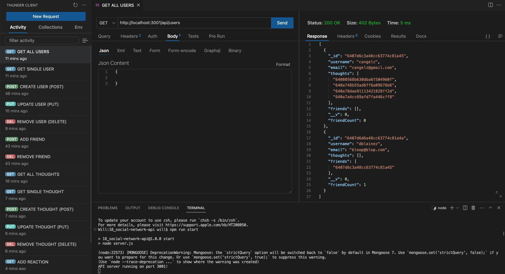

# Willy B's Social Network API

For this challenge, I used a NoSQL database with Mongoose to create a social network API that can handle large amounts of unstructured data.

This was my first deep-dive into NoSQL and MongoDB, which called for a process similar to that of [my e-commerce backend](https://github.com/willbrennana/13_ecommerce-backend). Testing API GET, POST, PUT and DELETE routes in Thunder Client to display data in JSON format.

As specified in the Challenge Acceptance Criteria, the backend of this social network achieves the following:

✨ I am able to start my server and the Mongoose models are synced to the MongoDB database.

✨ API GET routes for users and thoughts display data for each in a formatted JSON.

✨ API POST, PUT and DELETE routes successfully create, update and remove users and thoughts in the database.

✨ API POST and DLETE routes successfuly create and remove reactions to thoughts and add/remove friends to a user's friend list.

Below is a screenshot of my latest and greatest:

To view my video demo, click [here]().
